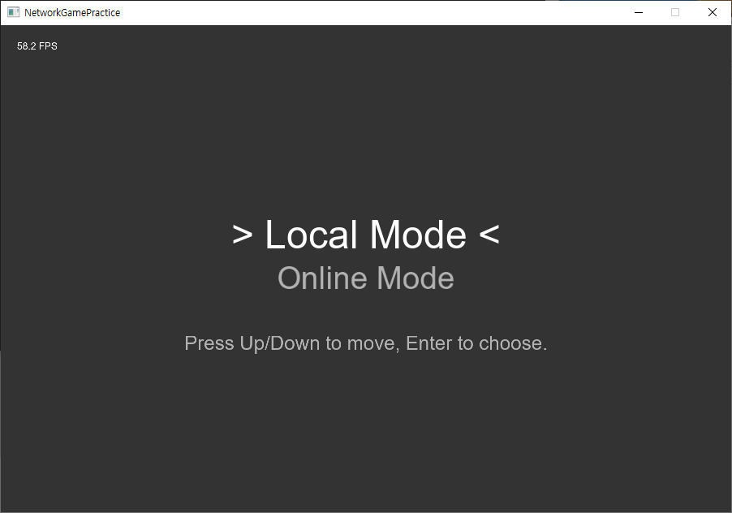
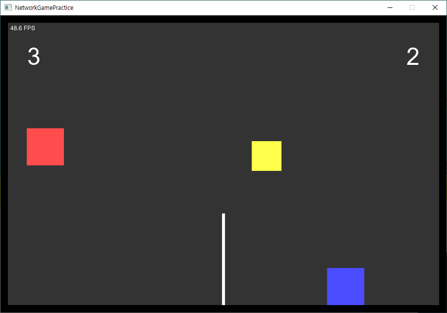
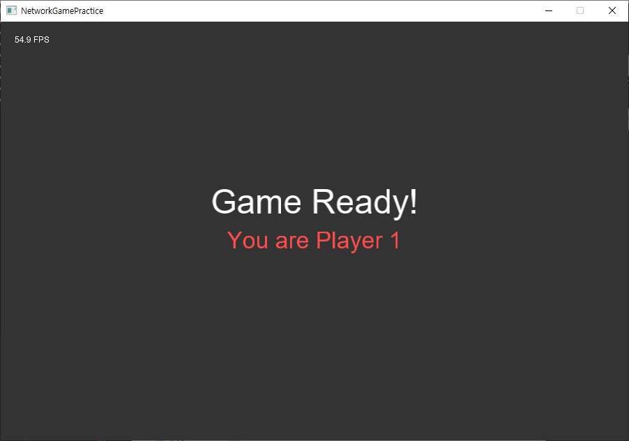
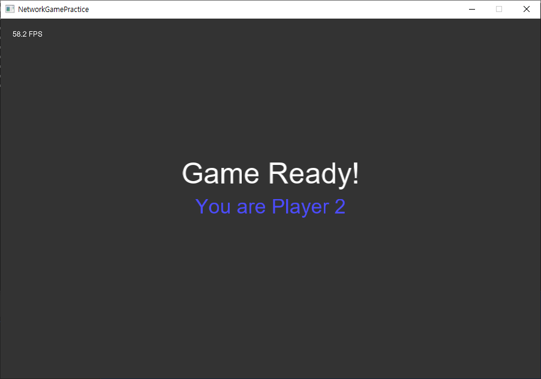
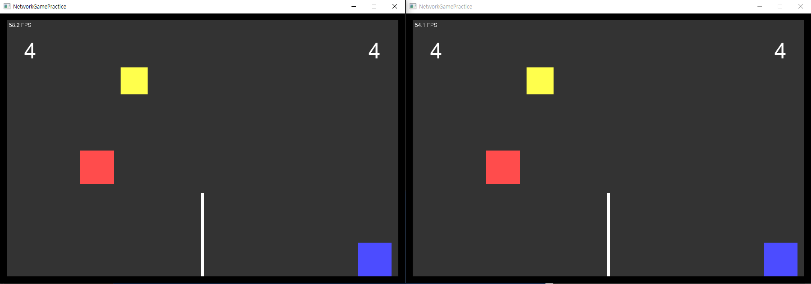

# NetworkGamePractice


## 프로젝트 개요
NetworkGamePractice는 C++ 기반의, 서버-클라이언트 구조를 갖춘 피카츄 배구 게임을 구현해 본 프로젝트입니다.  
이 프로젝트는 온라인 모드와 로컬 모드를 모두 지원합니다.

- 온라인 모드: 두 개의 클라이언트가 서버에 연결하여 각각 1P, 2P로 연결하여 대전하는 방식입니다. 전용 서버(Dedicated Server)를 통해 게임의 진행 상태가 두 플레이어에게 동기화됩니다.
- 로컬 모드: 하나의 클라이언트에서 1P와 2P를 동시에 조작하며 플레이할 수 있습니다.
---

## 주요 기능

### 서버 기능
- 클라이언트와의 TCP 연결 관리
- 게임 상태 연산 및 동기화
- 패킷 송수신 처리 및 입력 반영
- 클라이언트의 접속 및 종료 처리

### 클라이언트 기능
- 키 입력 처리 및 서버로 전송
- 서버의 응답을 받아 게임 화면 렌더링
- 네트워크 상태 확인 및 연결 유지
- 로컬 모드로 서버 없이 하나의 클라이언트에서 1P와 2P 동시 플레이

---

## 조작법  

| Player | 이동 | 슬라이딩/스파이크 |
|--------|------|------------------|
| Player 1 | `R` (왼쪽), `F` (오른쪽), `D` (점프), `G` (아래 커맨드)   | `Z` |
| Player 2 | `⬅` (왼쪽), `➡` (오른쪽), `⬆` (점프), `⬇` (아래 커맨드) | `Enter` |

### 설명:
- 이동: 플레이어는 좌우 이동이나 점프를 통해 공을 맞춰 상대방에게 넘길 수 있습니다.  
- 슬라이딩/스파이크: 공이 자신 쪽으로 올 때, 이동 키와 함께 스파이크 키를 누르면 공을 강하게 쳐낼 수 있습니다. 
- 로컬 모드에서는 한 사람이 두 캐릭터를 동시에 조작할 수 있습니다. 

---

## 실행 방법
### 1. 빌드 없이 실행하기 (Release 다운로드)
프로젝트를 직접 빌드하지 않고 실행하려면, [Releases](https://github.com/mmj4594/NetworkGamePractice/releases) 페이지에서 최신 버전을 다운로드하여 빌드 없이 실행할 수 있습니다.

`Release.zip` 파일 다운로드 및 압축 해제 후 실행 파일 실행:
   - 서버 실행: `Server.exe`
   - 클라이언트 실행: `Client.exe`

### 2. 빌드 및 실행 방법

#### 사전 요구사항
- C++11 이상
- CMake 3.15 이상
- Windows 환경

#### 서버 빌드 및 실행
```bash
cd Server
mkdir build
cd build
cmake ..
cmake --build . --config Release
```
```bash
cd Release
./Server.exe
```

#### 클라이언트 빌드 및 실행
```bash
cd Client
mkdir build
cd build
cmake ..
cmake --build . --config Release
```
```bash
cd Release
./Client.exe
```

---

## 게임 설정 변경
게임 설정은 `config.json` 파일을 수정하여 변경할 수 있습니다.
1. config.json을 텍스트 편집기로 열고, 원하는 값을 수정합니다.
2. 서버 및 클라이언트 파일을 재실행하면 변경 사항이 적용됩니다.

설정 가능한 항목은 아래와 같습니다.

### 1. 시스템 설정
| 항목                  | 설명                                           | 기본값 |
|-----------------------|-----------------------------------------------|--------|
| `screenWidth`         | 클라이언트 화면 너비 (픽셀)                     | `900`  |
| `screenHeight`        | 클라이언트 화면 높이 (픽셀)                     | `600`  |
| `clientMaxFPS`        | 클라이언트 최대 FPS 제한                        | `60`  |
| `serverMaxFPS`        | 서버 최대 FPS 제한                             | `60`   |
| `serverReplicateRate` | 서버가 클라이언트에 상태를 동기화하는 주기 (Hz)  | `20`   |

### 2. 게임 설정
| 항목         | 설명                                   | 기본값    |
|--------------|---------------------------------------|-----------|
| `maxScore`   | 한 플레이어가 승리하기 위해 필요한 점수  | `5`       |
| `timeScale`  | 게임 속도 배율 (기본값 1.0 = 정상 속도) | `1.0`     |
| `gravity`    | 중력 값 (음수 방향)                    | `-1000.0` |
| `playerSize` | 플레이어 크기 (픽셀)                   | `75.0`    |
| `ballSize`   | 공 크기 (픽셀)                         | `60.0`   |

### 3. 네트워크 설정
| 항목          | 설명                              | 기본값         |
|--------------|-----------------------------------|---------------|
| `serverHost` | 클라이언트에서 접속할 서버의 IP 주소 | `"127.0.0.1"` |
| `serverPort` | 서버 포트 번호                     | `9000`        |

---

## 프로젝트 구조
```
📂 NetworkGamePractice
 ┣ 📂 Server        # 서버 관련 코드
 ┣ 📂 Client        # 클라이언트 관련 코드
 ┣ 📂 include       # 헤더 파일
 ┣ 📂 screenshots   # 게임 플레이 이미지
 ┣ 📄 config.json   # 게임 설정 파일
 ┗ README.md        # 프로젝트 소개 파일
```

---

## 스크린샷

### 로컬 모드 플레이



### 온라인 모드 플레이  




